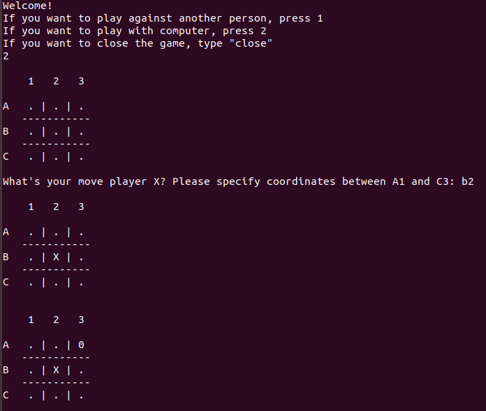

# Python-exercise-1-Tic-Tac-Toe
First exercise while learning Python

## General info
Exercise performed while learning Python during Codecool course.

## Screenshots

## Technologies
* Python 3

## Features
The tic-tac-toe game is programmed to:
* play with other human
* play with unbeatable AI
Game was programmed with user experience in mind (e.g. proper descriptions and clear input validation)

## Status
Project is finished. In the future might undergo some code refactoring.
